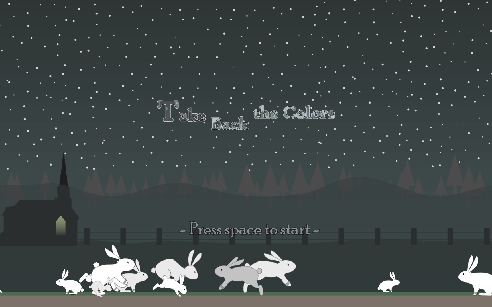
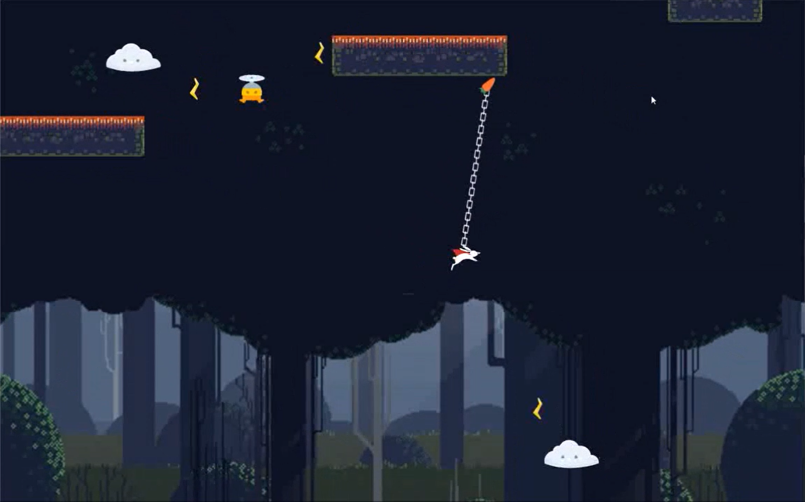
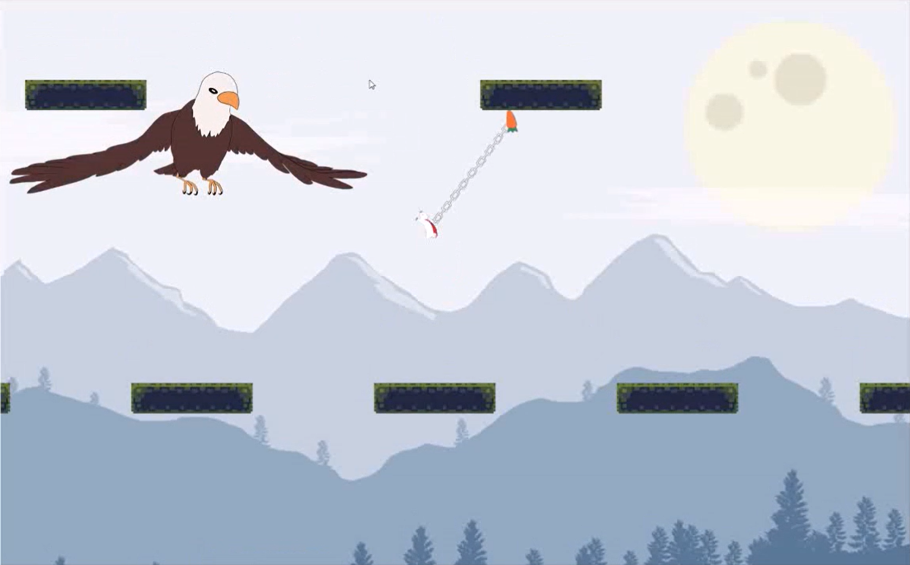

# Take Back the Colors

Web game link: https://j3soon.github.io/TakeBackTheColors/

## Controls

Basic Controls:
- Hold `A` to move left.
- Hold `D` to move right.
- Hold `W` to jump.
- Hold `S` while in air to fall faster.
- Hold `WA`, `WD` while touching the wall to perform a wall jump.

CarrotChain Controls: (Enabled after acquiring the black crystal)
- Hold mouse `left` key to shoot the chain / hold the chain.
- Release mouse `left` key to release the chain

## Demo (Video / Sreenshots)

Full game play-through video: https://youtu.be/_agOqPE2A-c





## Installation

- Run locally

  ```sh
  git clone https://github.com/j3soon/TakeBackTheColors
  cd TakeBackTheColors
  git reset --hard
  npm install
  npm run server:dev
  ```

- Build

  ```sh
  npm run build:dist
  ```

## Authors

Authors: [@j3soon](https://github.com/j3soon), [@tigerpaws01](https://github.com/tigerpaws01), [@RPKQ](https://github.com/RPKQ), [@lilihsu](https://github.com/lilihsu)

Special thanks to [@j00bcat](https://www.instagram.com/j00bcat/)

## Used template

This project is based on the template: [Phaser-CE NPM Webpack TypeScript Starter Project
](https://github.com/rroylance/phaser-ce-npm-webpack-typescript-starter-project), and its license is mentioned in the link.

Uses [Tiled Map Editor](https://www.mapeditor.org/) to edit the tile map.